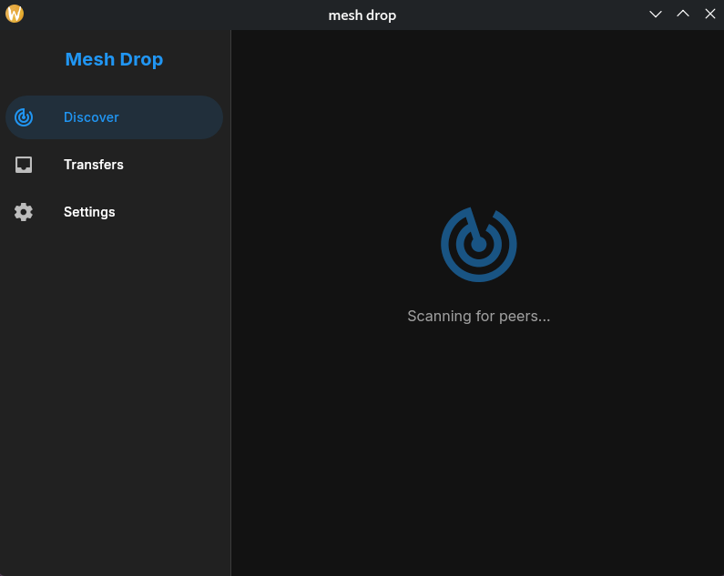
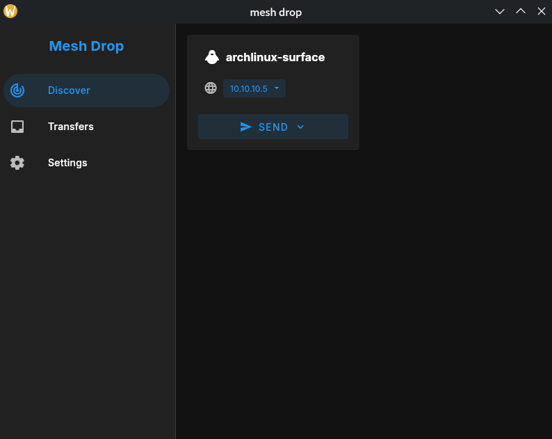

# Mesh Drop

简易、快速的局域网文件传输工具，基于 Wails 和 Vue 构建。

## 功能特性

- **文件传输**：支持多文件发送，轻松共享。
- **文件夹传输**：支持发送整个文件夹结构。
- **文本传输**：快速同步设备间的文本内容。
- **加密传输**：确保数据在传输过程中的安全性。

## 截图

|  |  |
| -------------------------------- | -------------------------------- |

## 待办事项

- [x] 剪辑板传输
- [x] 文件夹传输
- [x] 取消传输
- [x] 多文件发送
- [x] 加密传输
- [x] 设置页面
  - [x] 默认保存路径
  - [x] 设置主机名
  - [x] 保存历史
  - [x] 自动接收
- [x] 单例模式
- [x] 系统通知
- [ ] 应用图标
- [ ] 系统托盘（最小化到托盘）

## 技术栈

本项目使用现代化的技术栈构建：

- **后端**: [Go](https://go.dev/) + [Wails v3](https://v3.wails.io/)
- **前端**: [Vue 3](https://vuejs.org/) + [TypeScript](https://www.typescriptlang.org/)
- **UI 框架**: [Vuetify](https://vuetifyjs.com/)

## 开发

### 前置条件

在开始之前，请确保您的开发环境已安装以下工具：

1.  **Go** (版本 >= 1.25)
2.  **Node.js**
3.  **Wails CLI**

### 安装依赖

```bash
# 进入项目目录
cd mesh-drop

# 安装前端依赖 (通常 Wails 会自动处理，但手动安装可确保环境清晰)
cd frontend
npm install
cd ..
```

### 运行开发环境

```bash
wails dev
```
